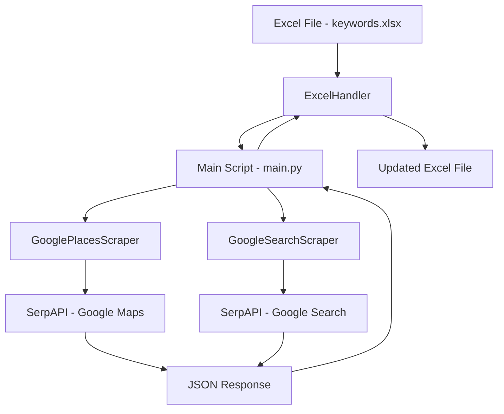
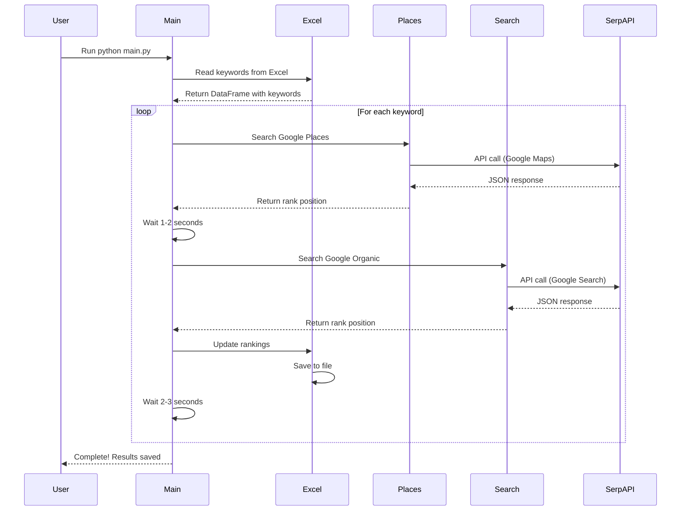

# Google Ranking Scraper - Complete Technical Documentation

## Table of Contents
1. [Project Overview](#project-overview)
2. [Architecture & Workflow](#architecture--workflow)
3. [File-by-File Code Summary](#file-by-file-code-summary)
4. [Technical Deep Dive](#technical-deep-dive)
5. [Possible Interview Questions & Answers](#possible-interview-questions--answers)
6. [API Documentation](#api-documentation)
7. [Data Flow Diagram](#data-flow-diagram)
8. [Error Handling & Edge Cases](#error-handling--edge-cases)
9. [Performance & Optimization](#performance--optimization)
10. [Future Enhancements](#future-enhancements)

---

## Project Overview

### What is This Project?
A **Python-based SEO ranking tracker** that monitors Google search positions for a target domain across multiple keywords using the SerpAPI service.

### Business Purpose
- Track keyword rankings for "Om Organic Kitchen" restaurant in Noida, India
- Monitor both Google Maps (Local Pack) and Organic search rankings
- Compare current rankings with historical data (2016-2019)
- Generate automated SEO reports in Excel format

### Key Metrics Tracked
1. **Google Places Rank** - Position in Google Maps/Local Pack (1, 2, 3...)
2. **Google Links Rank** - Position in organic search results (1-50)

### Target Domain
`omorganickitchen.com` - A food delivery/tiffin service in Noida, Uttar Pradesh, India

---

## Architecture & Workflow

### High-Level Architecture



### Component Architecture

```
┌─────────────────────────────────────────────────────────┐
│                     Main Script (main.py)                │
│  - Configuration Management                              │
│  - Orchestration Logic                                   │
│  - Rate Limiting & Progress Tracking                     │
└─────────────────────────────────────────────────────────┘
                    │                    │
        ┌───────────┴──────────┐        │
        ▼                      ▼         ▼
┌──────────────┐    ┌──────────────┐   ┌──────────────┐
│ Google       │    │ Google       │   │ Excel        │
│ Places       │    │ Search       │   │ Handler      │
│ Scraper      │    │ Scraper      │   │              │
└──────────────┘    └──────────────┘   └──────────────┘
        │                    │                  │
        └────────┬───────────┘                  │
                 ▼                               ▼
        ┌─────────────────┐          ┌──────────────────┐
        │   SerpAPI       │          │  Excel File      │
        │   Service       │          │  (openpyxl)      │
        └─────────────────┘          └──────────────────┘
```

### Workflow Sequence



---

## File-by-File Code Summary

### 1. `main.py` (123 lines)

**Purpose**: Entry point and orchestration script

**Key Components**:
- **Configuration Section** (Lines 16-21):
  ```python
  EXCEL_FILE = "./keywords.xlsx"
  SHEET_NAME = "Keywords"
  HEADER_ROW = 1
  TARGET_DOMAIN = "omorganickitchen.com"
  LOCATION = "Noida, Uttar Pradesh, India"
  SERPAPI_API_KEY = "043a5aabdc2f17335b1e4d707302d3b13043a692629d701c0717a5eed2cee782"
  ```

- **Initialization** (Lines 33-35):
  - Creates `ExcelHandler` instance
  - Creates `GoogleSearchScraper` instance
  - Creates `GooglePlacesScraper` instance

- **Main Loop** (Lines 58-97):
  - Iterates through each keyword
  - Calls Places scraper
  - Waits 1-2 seconds
  - Calls Search scraper
  - Updates Excel file
  - Waits 2-3 seconds

**Error Handling**:
- Try-except for Excel reading errors
- Column validation
- KeyboardInterrupt handling (Ctrl+C)
- General exception handling with traceback

**Rate Limiting**:
- Random delay 1-2s between Places and Search
- Random delay 2-3s between keywords

---

### 2. `scraper/google_search.py` (94 lines)

**Purpose**: Handles Google organic search ranking

**Class**: `GoogleSearchScraper`

**Key Methods**:

#### `__init__(self, api_key, target_domain, location)`
- Initializes API key, target domain, location
- Sets `max_pages = 5` (searches top 50 results)
- Sets `results_per_page = 10`

#### `search(self, keyword) -> Optional[int]`
**Algorithm**:
1. Loop through 5 pages (0-4)
2. Calculate start position: `start = page_num * 10`
3. Make SerpAPI call with parameters:
   - `engine`: "google"
   - `google_domain`: "google.co.in"
   - `q`: keyword
   - `gl`: "in" (India)
   - `hl`: "en" (English)
   - `location`: "Noida, Uttar Pradesh, India"
   - `start`: pagination offset
4. Extract `organic_results` from JSON
5. For each result:
   - Parse URL domain
   - Remove "www."
   - Check if target domain matches
   - Return absolute position (1-50)
6. Return None if not found

**Domain Matching Logic**:
```python
domain = urlparse(link).netloc.lower()
domain = domain.replace("www.", "")
if self.target_domain in domain or domain in self.target_domain:
    return position
```

**Output**:
- Integer (1-50) if found
- None if not found in top 50

---

### 3. `scraper/google_places.py` (98 lines)

**Purpose**: Handles Google Maps/Local Pack ranking

**Class**: `GooglePlacesScraper`

**Key Methods**:

#### `__init__(self, api_key, target_domain, location)`
- Initializes API key, target domain, location
- No pagination needed (Local Pack is limited)

#### `search(self, keyword) -> Optional[int]`
**Algorithm**:
1. Make single SerpAPI call with parameters:
   - `engine`: "google_maps"
   - `type`: "search"
   - `google_domain`: "google.co.in"
   - `q`: keyword
   - `hl`: "en"
   - `gl`: "in"
   - `location`: "Noida, Uttar Pradesh, India"
   - `z`: "20" (zoom level)
2. Extract `local_results` from JSON
3. For each result, check THREE fields:
   - **website**: Check domain in URL
   - **title**: Check for business name variations
   - **link**: Fallback domain check
4. Return position (1, 2, 3...) if found
5. Return None if not found

**Multi-Field Matching**:
```python
# Check 1: Website URL
website = result.get("website", "")
if self.target_domain in domain:
    return idx

# Check 2: Title variations
title = result.get("title", "").lower()
if 'omorganic' in title or 'om organic' in title:
    return idx

# Check 3: Link field
link = result.get("link", "")
if self.target_domain in domain:
    return idx
```

**Output**:
- Integer (1, 2, 3...) if found in Local Pack
- None if not found

---

### 4. `utils/excel.py` (118 lines)

**Purpose**: Excel file reading and writing with format preservation

**Class**: `ExcelHandler`

**Attributes**:
```python
self.excel_file = excel_file
self.keyword_column = "Local Keyword Ideas"
self.places_column = "Google Places"
self.links_column = "Google Links"
```

**Key Methods**:

#### `read_keywords(self, sheet_name, header_row) -> pd.DataFrame`
**Purpose**: Read keywords using pandas

**Process**:
1. Use `pd.read_excel()` with specified header row
2. Return DataFrame with all columns
3. Raise exception if file not found

**Why pandas?**
- Easy filtering and data manipulation
- Works with DataFrame index for row tracking

#### `update_rankings(self, row_index, places_rank, links_rank, sheet_name, header_row) -> bool`
**Purpose**: Update Excel file while preserving formatting

**Process**:
1. Load workbook using `openpyxl` (not pandas!)
2. Find column letters for "Google Places" and "Google Links"
   - Searches header row and next row (for merged cells)
   - Stores column letters (e.g., "AB", "AC")
3. Calculate Excel row number:
   ```python
   excel_row = row_index + header_row + 2
   ```
   - `row_index`: pandas DataFrame index (0-based)
   - `header_row`: 1 (Excel row 2)
   - `+2`: Converts to Excel row number
4. Update cells:
   ```python
   ws[f"{places_col_letter}{excel_row}"] = places_rank or "Not Found"
   ws[f"{links_col_letter}{excel_row}"] = links_rank or "Not Found"
   ```
5. Save workbook (overwrites file)

**Why openpyxl for writing?**
- Preserves Excel formatting (colors, borders, formulas)
- pandas would destroy formatting

**Critical Row Calculation**:
- If keyword is at pandas index 5, header_row=1:
- Excel row = 5 + 1 + 2 = 8
- This accounts for: header row + 0-based indexing + Excel 1-based rows

---

### 5. `requirements.txt` (4 lines)

```
pandas>=2.0.0              # Data manipulation and Excel reading
openpyxl>=3.1.0           # Excel writing with format preservation
google-search-results>=2.4.2  # SerpAPI official Python SDK
```

**Why these specific libraries?**
- **pandas**: Industry standard for data analysis
- **openpyxl**: Only library that preserves Excel formatting
- **google-search-results**: Official SerpAPI client (not web scraping!)

---

### 6. Project Structure

```
SEO_Finall/
│
├── main.py                          # Entry point (123 lines)
│   └── main() function              # Orchestrates entire workflow
│
├── scraper/                         # Scraper package
│   ├── __init__.py                 # Makes it a Python package
│   ├── google_search.py            # Organic search (94 lines)
│   │   └── GoogleSearchScraper     # Class with search() method
│   └── google_places.py            # Local search (98 lines)
│       └── GooglePlacesScraper     # Class with search() method
│
├── utils/                           # Utilities package
│   ├── __init__.py                 # Makes it a Python package
│   └── excel.py                    # Excel handler (118 lines)
│       └── ExcelHandler            # Class with read/write methods
│
├── keywords.xlsx                    # Data file (21 rows, 35 columns)
│   └── Sheet: "Keywords"           # Main worksheet
│       ├── Local Keyword Ideas     # Input column
│       ├── Targeted Page           # Reference column
│       ├── Google Places           # Output column (updated)
│       └── Google Links            # Output column (updated)
│
├── requirements.txt                 # Dependencies (3 packages)
├── README.md                        # User documentation
├── SETUP.md                         # Setup instructions
├── .gitignore                       # Git exclusions
├── .venv/                          # Virtual environment (excluded from git)
└── __pycache__/                    # Python bytecode cache (excluded from git)
```

---

## Technical Deep Dive

### 1. SerpAPI Integration

#### What is SerpAPI?
- **Type**: RESTful API service
- **Purpose**: Provides Google search results as structured JSON
- **Pricing**: Pay-per-search model
- **Advantage**: No HTML parsing, no CAPTCHAs, no browser needed

#### API Engines Used

**Google Search Engine**:
```python
params = {
    "api_key": "YOUR_KEY",
    "engine": "google",           # Regular Google search
    "google_domain": "google.co.in",  # India domain
    "q": "keyword",               # Search query
    "gl": "in",                   # Geolocation: India
    "hl": "en",                   # Language: English
    "location": "Noida, Uttar Pradesh, India",
    "start": "0"                  # Pagination offset
}
```

**Response Structure**:
```json
{
  "search_metadata": {...},
  "search_parameters": {...},
  "organic_results": [
    {
      "position": 1,
      "title": "Result Title",
      "link": "https://example.com",
      "displayed_link": "example.com",
      "snippet": "Description..."
    }
  ]
}
```

**Google Maps Engine**:
```python
params = {
    "api_key": "YOUR_KEY",
    "engine": "google_maps",      # Google Maps search
    "type": "search",             # Search type (not directions)
    "google_domain": "google.co.in",
    "q": "keyword",
    "hl": "en",
    "gl": "in",
    "location": "Noida, Uttar Pradesh, India",
    "z": "20"                     # Zoom level (1-21)
}
```

**Response Structure**:
```json
{
  "search_metadata": {...},
  "search_parameters": {...},
  "local_results": [
    {
      "position": 1,
      "title": "Business Name",
      "rating": 4.5,
      "reviews": 123,
      "type": "Restaurant",
      "address": "123 Street, City",
      "website": "https://example.com",
      "link": "https://maps.google.com/..."
    }
  ]
}
```

#### API Call Flow

```python
from serpapi import GoogleSearch

# 1. Create search object with parameters
search = GoogleSearch(params)

# 2. Make API call and get JSON response
results = search.get_dict()

# 3. Extract relevant data
organic_results = results.get("organic_results", [])
local_results = results.get("local_results", [])

# 4. Check for errors
if "error" in results:
    print(f"API Error: {results['error']}")
```

---

### 2. Excel File Structure

#### Sheet Layout

```
Row 1: [Empty or title]
Row 2: Headers
       | SN | Local Keyword Ideas | Targeted Page | ... | Google Places | Google Links |
Row 3: Data starts
       | 1  | home delivery food  | https://...   | ... | 3             | 5            |
Row 4: | 2  | tiffin service      | https://...   | ... | 2             | 4            |
...
```

#### Column Details

| Column Name | Type | Purpose | Updated By |
|-------------|------|---------|------------|
| SN | Integer | Serial number | Manual |
| Local Keyword Ideas | String | Keywords to search | Manual |
| Targeted Page | URL | Page being tracked | Manual |
| 2016-08-31, 2016-09-30... | Integer | Historical rankings | Manual/Historical |
| Google Places | Integer/String | Current Local Pack rank | Script |
| Google Links | Integer/String | Current organic rank | Script |

#### Data Types

**Input**:
- Keywords: String (e.g., "tiffin service in noida")
- Target Page: URL string

**Output**:
- Rank found: Integer (1, 2, 3... or 1-50)
- Not found: String "Not Found"
- Empty: None/NaN

---

### 3. Rate Limiting Strategy

#### Why Rate Limiting?

1. **API Limits**: SerpAPI has rate limits (varies by plan)
2. **Cost Control**: Each API call costs money
3. **Politeness**: Avoid overwhelming the service
4. **Natural Behavior**: Mimics human search patterns

#### Implementation

```python
import time
import random

# Between Places and Search for same keyword
time.sleep(random.uniform(1, 2))  # 1-2 seconds

# Between different keywords
delay = random.uniform(2, 3)  # 2-3 seconds
time.sleep(delay)
```

#### Timing Breakdown

For 20 keywords:
- Places search: ~1-2 seconds each = 20-40s
- Wait after Places: 1-2s × 20 = 20-40s
- Organic search: ~5-10 seconds each (5 pages) = 100-200s
- Wait between keywords: 2-3s × 19 = 38-57s

**Total Time**: ~3-6 minutes for 20 keywords

---

### 4. Domain Matching Algorithm

#### Challenge
URLs can appear in various formats:
- `https://www.omorganickitchen.com/page`
- `http://omorganickitchen.com`
- `https://omorganickitchen.com/`
- Subdomains: `blog.omorganickitchen.com`

#### Solution

```python
from urllib.parse import urlparse

# 1. Parse URL to extract domain
link = "https://www.omorganickitchen.com/menu"
domain = urlparse(link).netloc.lower()
# Result: "www.omorganickitchen.com"

# 2. Remove www prefix
domain = domain.replace("www.", "")
# Result: "omorganickitchen.com"

# 3. Bidirectional matching
target = "omorganickitchen.com"
if target in domain or domain in target:
    # Matches!
```

#### Why Bidirectional?
- `target in domain`: Catches subdomains (blog.omorganickitchen.com)
- `domain in target`: Catches partial matches

---

### 5. Error Handling

#### Types of Errors Handled

**1. Excel File Errors**:
```python
try:
    df = excel_handler.read_keywords(SHEET_NAME, HEADER_ROW)
except Exception as e:
    print(f"✗ Error reading Excel file: {e}")
    return 1
```

**2. Column Validation**:
```python
if excel_handler.keyword_column not in df.columns:
    print(f"✗ Column '{excel_handler.keyword_column}' not found")
    print(f"Available columns: {list(df.columns)}")
    return 1
```

**3. API Errors**:
```python
if "error" in results:
    print(f"✗ API Error: {results.get('error')}")
    return None
```

**4. Keyboard Interrupt**:
```python
except KeyboardInterrupt:
    print("\n\n⚠ Process interrupted by user")
    print(f"✓ Progress saved to {EXCEL_FILE}")
    return 1
```

**5. General Exceptions**:
```python
except Exception as e:
    print(f"\n✗ Error: {e}")
    import traceback
    traceback.print_exc()
    return 1
```

---

## Possible Interview Questions & Answers

### General Questions

#### Q1: What is this project about?
**Answer**: This is an SEO ranking tracker that monitors where a specific website (omorganickitchen.com) ranks in Google search results for various keywords. It tracks both Google Maps (Local Pack) rankings and organic search rankings, updating an Excel file with the results. The project uses SerpAPI to fetch real-time Google search data.

#### Q2: Why did you build this?
**Answer**: To automate SEO monitoring for a restaurant business in Noida, India. Instead of manually searching Google for each keyword and noting the position, this tool automates the entire process, saving hours of manual work and providing consistent, trackable data over time.

#### Q3: What problem does it solve?
**Answer**: 
1. **Time-saving**: Automates manual ranking checks
2. **Consistency**: Eliminates human error in tracking
3. **Historical tracking**: Compares current vs historical rankings
4. **Reporting**: Generates client-ready Excel reports
5. **Scalability**: Can track hundreds of keywords automatically

---

### Technical Questions

#### Q4: Why use SerpAPI instead of web scraping?
**Answer**:
- **Reliability**: Web scraping breaks when Google changes HTML structure
- **No CAPTCHAs**: SerpAPI handles anti-bot measures
- **Legal compliance**: Paid service vs violating Google's ToS
- **Structured data**: Clean JSON vs messy HTML parsing
- **Maintenance**: API is stable, HTML changes frequently
- **Speed**: Direct API calls vs loading full web pages

#### Q5: How does the ranking algorithm work?
**Answer**:
1. **For Organic Search**:
   - Makes up to 5 API calls (pages 1-5)
   - Each page has 10 results = top 50 results total
   - Checks each result's URL for target domain
   - Returns absolute position (1-50) or None

2. **For Google Places**:
   - Makes single API call to Google Maps
   - Checks local_results array
   - Matches domain in website, title, or link fields
   - Returns position (1, 2, 3...) or None

#### Q6: How do you preserve Excel formatting?
**Answer**:
- **Reading**: Use `pandas` for easy data manipulation
- **Writing**: Use `openpyxl` to update cells directly
- **Why not pandas for writing?**: pandas.to_excel() overwrites the entire file, destroying formatting
- **openpyxl approach**: Loads existing workbook, updates specific cells, saves back

```python
# Load existing workbook
wb = load_workbook(self.excel_file)
ws = wb[sheet_name]

# Update specific cell
ws[f"{column_letter}{row_number}"] = value

# Save (preserves formatting)
wb.save(self.excel_file)
```

#### Q7: How do you handle rate limiting?
**Answer**:
- **Between searches**: Random delay 1-2 seconds
- **Between keywords**: Random delay 2-3 seconds
- **Why random?**: Mimics human behavior, avoids detection patterns
- **Implementation**: `time.sleep(random.uniform(min, max))`

#### Q8: What happens if the script crashes midway?
**Answer**:
- **Progress is saved**: Excel file is updated after each keyword
- **Resume capability**: Can manually skip processed keywords
- **Keyboard interrupt**: Ctrl+C gracefully exits with progress saved
- **Error handling**: Try-except blocks prevent complete failure

#### Q9: How do you match domains in URLs?
**Answer**:
```python
# 1. Parse URL
domain = urlparse(link).netloc.lower()

# 2. Normalize (remove www)
domain = domain.replace("www.", "")

# 3. Bidirectional match
if target_domain in domain or domain in target_domain:
    return True
```
This handles:
- www vs non-www
- Subdomains (blog.example.com)
- Different protocols (http/https)
- Trailing slashes

#### Q10: Why use two different SerpAPI engines?
**Answer**:
- **google_maps engine**: Returns Local Pack results (Google Maps listings)
- **google engine**: Returns organic search results (blue links)
- These are different result types with different ranking algorithms
- Local SEO vs traditional SEO require separate tracking

---

### Architecture Questions

#### Q11: Explain the project structure
**Answer**:
```
main.py              # Orchestration layer
├── scraper/         # Business logic layer
│   ├── google_search.py    # Organic search
│   └── google_places.py    # Local search
└── utils/           # Data access layer
    └── excel.py     # Excel operations
```

**Separation of concerns**:
- **main.py**: Configuration, workflow, rate limiting
- **scrapers**: API interaction, domain matching
- **utils**: Data persistence

#### Q12: What design patterns did you use?
**Answer**:
1. **Separation of Concerns**: Each module has single responsibility
2. **Dependency Injection**: Scrapers receive API key and config
3. **Factory Pattern**: Creating scraper instances
4. **Template Method**: Both scrapers follow same search() interface
5. **Error Handling Pattern**: Consistent try-except structure

#### Q13: How would you scale this to 1000 keywords?
**Answer**:
1. **Parallel processing**: Use `concurrent.futures` for multiple API calls
2. **Batch processing**: Process in chunks of 100
3. **Database**: Replace Excel with PostgreSQL/MySQL
4. **Queue system**: Use Celery/RabbitMQ for distributed processing
5. **Caching**: Cache results for duplicate keywords
6. **API key rotation**: Use multiple SerpAPI accounts

#### Q14: What are the limitations?
**Answer**:
1. **Cost**: Each keyword = 2 API calls = 2× cost
2. **Speed**: Rate limiting makes it slow (3-6 min for 20 keywords)
3. **API dependency**: Relies on SerpAPI staying operational
4. **Excel limitations**: Not suitable for large datasets (>10,000 rows)
5. **Single-threaded**: Processes one keyword at a time
6. **No historical tracking**: Overwrites previous results

---

### Code Quality Questions

#### Q15: How do you ensure code quality?
**Answer**:
- **Type hints**: `Optional[int]`, `str`, `pd.DataFrame`
- **Docstrings**: Every function has documentation
- **Error handling**: Try-except blocks everywhere
- **Logging**: Print statements for debugging
- **Constants**: Configuration at top of file
- **Modularity**: Reusable classes and functions

#### Q16: What would you improve?
**Answer**:
1. **Configuration file**: Move hardcoded values to config.yaml
2. **Environment variables**: Store API key in .env
3. **Logging framework**: Replace print() with logging module
4. **Unit tests**: Add pytest tests for each module
5. **CLI arguments**: Accept parameters via command line
6. **Progress bar**: Add tqdm for visual progress
7. **Retry logic**: Retry failed API calls
8. **Async/await**: Use asyncio for parallel requests

#### Q17: How would you test this?
**Answer**:
```python
# Unit tests
def test_domain_matching():
    scraper = GoogleSearchScraper(api_key, "example.com", "Location")
    assert scraper._matches_domain("https://www.example.com/page")
    assert not scraper._matches_domain("https://other.com")

# Integration tests
def test_serpapi_integration():
    scraper = GoogleSearchScraper(api_key, "google.com", "USA")
    rank = scraper.search("search engine")
    assert rank == 1  # Google should rank #1 for "search engine"

# Mock tests
@patch('serpapi.GoogleSearch')
def test_search_with_mock(mock_search):
    mock_search.return_value.get_dict.return_value = {
        "organic_results": [{"link": "https://example.com"}]
    }
    scraper = GoogleSearchScraper(api_key, "example.com", "Location")
    rank = scraper.search("test")
    assert rank == 1
```

---

### Data Questions

#### Q18: What data does the Excel file contain?
**Answer**:
- **21 rows**: 1 header + 20 keywords
- **35 columns**: 
  - SN (serial number)
  - Local Keyword Ideas (input)
  - Targeted Page (reference)
  - 30 historical date columns (2016-2019)
  - Google Places (output)
  - Google Links (output)

#### Q19: What are the keywords being tracked?
**Answer**:
1. home delivery food near me
2. tiffin service provider
3. tiffin service in noida
4. tiffin service online
5. healthy tiffin service
6. office tiffin service
7. monthly tiffin service
8. home delivery tiffin service
9. best tiffin service in noida
10. organic food delivery
... (20 total)

All related to food delivery/tiffin services in Noida, India.

#### Q20: How is historical data used?
**Answer**:
- **Comparison**: Compare current rank vs previous months
- **Trend analysis**: Identify improving/declining keywords
- **ROI tracking**: Measure SEO campaign effectiveness
- **Reporting**: Show clients progress over time
- **Strategy**: Focus on keywords with declining ranks

---

### API Questions

#### Q21: What is SerpAPI?
**Answer**:
- **Service**: RESTful API for Google search results
- **Pricing**: Pay-per-search (varies by plan)
- **Response**: Structured JSON data
- **Engines**: Google, Google Maps, Bing, Yahoo, etc.
- **Features**: Handles CAPTCHAs, proxies, rate limits

#### Q22: How much does it cost?
**Answer**:
- **Free tier**: 100 searches/month
- **Paid plans**: Start at $50/month for 5,000 searches
- **This project**: 20 keywords × 2 searches = 40 searches per run
- **Monthly cost**: If run daily = 40 × 30 = 1,200 searches ≈ $50/month

#### Q23: What are the API parameters?
**Answer**:

**Google Search**:
- `engine`: "google" (search engine type)
- `google_domain`: "google.co.in" (country domain)
- `q`: keyword (search query)
- `gl`: "in" (geolocation)
- `hl`: "en" (language)
- `location`: "Noida, Uttar Pradesh, India"
- `start`: pagination offset (0, 10, 20...)

**Google Maps**:
- `engine`: "google_maps"
- `type`: "search"
- `q`: keyword
- `location`: "Noida, Uttar Pradesh, India"
- `z`: "20" (zoom level)

#### Q24: What if the API key expires?
**Answer**:
- **Error handling**: Code checks for "error" in response
- **Graceful failure**: Returns None instead of crashing
- **User notification**: Prints error message
- **Solution**: Update `SERPAPI_API_KEY` in main.py

---

### Performance Questions

#### Q25: How long does it take to run?
**Answer**:
- **Per keyword**: 
  - Places search: 1-2s
  - Wait: 1-2s
  - Organic search: 5-10s (5 pages)
  - Wait: 2-3s
  - Total: ~10-17s per keyword

- **20 keywords**: 3-6 minutes total

#### Q26: How can you make it faster?
**Answer**:
1. **Reduce pages**: Search only 3 pages instead of 5
2. **Parallel requests**: Use asyncio or threading
3. **Batch API calls**: SerpAPI supports batch requests
4. **Remove delays**: Risk rate limiting
5. **Cache results**: Store results for 24 hours
6. **Optimize Excel**: Write all results at once, not per keyword

#### Q27: What's the bottleneck?
**Answer**:
1. **API calls**: Each search takes 1-2 seconds
2. **Rate limiting**: Intentional delays (2-3s between keywords)
3. **Sequential processing**: One keyword at a time
4. **Excel I/O**: Writing to file after each keyword

**Solution**: Parallel processing with async/await

---

### Business Questions

#### Q28: What's the ROI of this tool?
**Answer**:
- **Manual time**: 20 keywords × 2 minutes = 40 minutes/day
- **Automated time**: 5 minutes/day (just run script)
- **Time saved**: 35 minutes/day = 175 hours/year
- **Cost**: $50/month = $600/year
- **Value**: If hourly rate is $20, saves $3,500/year

#### Q29: Who is the target user?
**Answer**:
- **SEO agencies**: Track client rankings
- **Digital marketers**: Monitor campaign performance
- **Business owners**: Track their own SEO
- **Freelancers**: Provide ranking reports to clients

#### Q30: What are alternative solutions?
**Answer**:
1. **Manual tracking**: Free but time-consuming
2. **SEMrush/Ahrefs**: $99-399/month (expensive)
3. **SerpWatcher**: $49/month (limited features)
4. **Google Search Console**: Free but limited data
5. **This tool**: $50/month (customizable, affordable)

---

## API Documentation

### SerpAPI Python SDK

#### Installation
```bash
pip install google-search-results
```

#### Basic Usage
```python
from serpapi import GoogleSearch

params = {
    "api_key": "YOUR_API_KEY",
    "engine": "google",
    "q": "pizza"
}

search = GoogleSearch(params)
results = search.get_dict()
```

#### Response Structure

**Successful Response**:
```json
{
  "search_metadata": {
    "id": "search_id",
    "status": "Success",
    "created_at": "2024-01-01 12:00:00 UTC",
    "processed_at": "2024-01-01 12:00:01 UTC",
    "total_time_taken": 1.23
  },
  "search_parameters": {
    "engine": "google",
    "q": "pizza",
    "location": "New York, USA"
  },
  "organic_results": [
    {
      "position": 1,
      "title": "Pizza - Wikipedia",
      "link": "https://en.wikipedia.org/wiki/Pizza",
      "displayed_link": "en.wikipedia.org › wiki › Pizza",
      "snippet": "Pizza is a dish of Italian origin...",
      "snippet_highlighted_words": ["Pizza"],
      "sitelinks": {...},
      "rich_snippet": {...}
    }
  ],
  "local_results": [...],
  "related_searches": [...]
}
```

**Error Response**:
```json
{
  "error": "Invalid API key",
  "search_metadata": {
    "status": "Error"
  }
}
```

---

## Data Flow Diagram

### Complete Data Flow

```
┌─────────────────────────────────────────────────────────────────┐
│                        START: User runs script                   │
└────────────────────────────┬────────────────────────────────────┘
                             │
                             ▼
┌─────────────────────────────────────────────────────────────────┐
│  Step 1: Load Configuration                                      │
│  - Read EXCEL_FILE, TARGET_DOMAIN, LOCATION, API_KEY            │
│  - Initialize ExcelHandler, GoogleSearchScraper, GooglePlaces   │
└────────────────────────────┬────────────────────────────────────┘
                             │
                             ▼
┌─────────────────────────────────────────────────────────────────┐
│  Step 2: Read Excel File                                         │
│  - pandas.read_excel() → DataFrame                               │
│  - Filter rows where keyword is not null                         │
│  - Total: 20 keywords                                            │
└────────────────────────────┬────────────────────────────────────┘
                             │
                             ▼
┌─────────────────────────────────────────────────────────────────┐
│  Step 3: Loop Through Keywords (1/20 to 20/20)                   │
└────────────────────────────┬────────────────────────────────────┘
                             │
                ┌────────────┴────────────┐
                │                         │
                ▼                         ▼
┌──────────────────────────┐   ┌──────────────────────────┐
│  Step 4a: Google Places  │   │  Step 4b: Google Search  │
│  - API call to Maps      │   │  - API calls (5 pages)   │
│  - Check local_results   │   │  - Check organic_results │
│  - Return rank or None   │   │  - Return rank or None   │
└──────────┬───────────────┘   └──────────┬───────────────┘
           │                              │
           └──────────┬───────────────────┘
                      │
                      ▼
┌─────────────────────────────────────────────────────────────────┐
│  Step 5: Update Excel                                            │
│  - openpyxl.load_workbook()                                      │
│  - Find column letters for "Google Places" & "Google Links"     │
│  - Calculate Excel row number                                    │
│  - Update cells with rank or "Not Found"                        │
│  - Save workbook                                                 │
└────────────────────────────┬────────────────────────────────────┘
                             │
                             ▼
┌─────────────────────────────────────────────────────────────────┐
│  Step 6: Rate Limiting                                           │
│  - time.sleep(random.uniform(2, 3))                             │
└────────────────────────────┬────────────────────────────────────┘
                             │
                             ▼
                    ┌────────┴────────┐
                    │ More keywords?  │
                    └────────┬────────┘
                         Yes │    │ No
                ┌────────────┘    │
                │                 │
                ▼                 ▼
        ┌──────────────┐   ┌──────────────┐
        │ Next keyword │   │   Complete   │
        └──────────────┘   └──────────────┘
```

---

## Error Handling & Edge Cases

### Error Scenarios

#### 1. Excel File Not Found
```python
FileNotFoundError: [Errno 2] No such file or directory: './keywords.xlsx'
```
**Handling**: Try-except in read_keywords(), prints error, exits with code 1

#### 2. Sheet Not Found
```python
ValueError: Worksheet Keywords does not exist.
```
**Handling**: Try-except catches, prints available sheets, exits

#### 3. Column Not Found
```python
Column 'Local Keyword Ideas' not found
Available columns: ['SN', 'Keywords', ...]
```
**Handling**: Validation check before processing, prints available columns

#### 4. API Key Invalid
```python
API Error: Invalid API key
```
**Handling**: Checks for "error" in response, returns None, continues to next keyword

#### 5. No Results Found
```python
No organic results found
Domain not found in Local results
```
**Handling**: Returns None, writes "Not Found" to Excel

#### 6. Network Error
```python
requests.exceptions.ConnectionError: Failed to establish connection
```
**Handling**: Try-except in search methods, prints error, returns None

#### 7. Keyboard Interrupt (Ctrl+C)
```python
KeyboardInterrupt
```
**Handling**: Catches exception, prints progress saved message, exits gracefully

#### 8. Excel File Open/Locked
```python
PermissionError: [Errno 13] Permission denied: 'keywords.xlsx'
```
**Handling**: openpyxl raises error, caught by try-except, prints error

---

### Edge Cases

#### 1. Empty Keyword
```python
if not keyword:
    continue
```
**Handling**: Skips to next keyword

#### 2. Keyword with Special Characters
```python
keyword = "pizza & pasta"
```
**Handling**: SerpAPI handles URL encoding automatically

#### 3. Domain with Subdomain
```python
link = "https://blog.omorganickitchen.com/post"
```
**Handling**: Bidirectional matching catches it:
```python
if "omorganickitchen.com" in "blog.omorganickitchen.com":  # True
```

#### 4. Domain with www
```python
link = "https://www.omorganickitchen.com"
```
**Handling**: Removes www before matching:
```python
domain = domain.replace("www.", "")
```

#### 5. Multiple Matches on Same Page
```python
# Position 3 and 7 both have target domain
```
**Handling**: Returns first match (position 3)

#### 6. No Organic Results (Only Ads)
```python
organic_results = []
```
**Handling**: Checks if empty, returns None

#### 7. Pagination Ends Early
```python
# Only 2 pages of results instead of 5
```
**Handling**: Loop breaks when organic_results is empty

#### 8. Merged Excel Cells
```python
# "Google Rank" header spans 2 columns
```
**Handling**: Searches both header row and next row for column names

---

## Performance & Optimization

### Current Performance Metrics

| Metric | Value |
|--------|-------|
| Keywords processed | 20 |
| API calls per keyword | 2 (Places + Search) |
| Total API calls | 40 |
| Time per keyword | 10-17 seconds |
| Total runtime | 3-6 minutes |
| API cost per run | ~$0.40 (at $0.01/search) |
| Excel writes | 20 (one per keyword) |

### Bottlenecks

1. **Sequential Processing** (biggest bottleneck)
   - One keyword at a time
   - No parallelization

2. **Rate Limiting Delays**
   - 1-2s between Places and Search
   - 2-3s between keywords
   - Total delay: ~60-100s

3. **API Response Time**
   - Each API call: 1-2 seconds
   - 5 pages for organic: 5-10 seconds

4. **Excel I/O**
   - Writing after each keyword
   - Loading/saving workbook: ~0.5s each

### Optimization Strategies

#### 1. Parallel Processing
```python
import concurrent.futures

def process_keyword(keyword):
    places_rank = places_scraper.search(keyword)
    links_rank = search_scraper.search(keyword)
    return (keyword, places_rank, links_rank)

with concurrent.futures.ThreadPoolExecutor(max_workers=5) as executor:
    futures = [executor.submit(process_keyword, kw) for kw in keywords]
    results = [f.result() for f in concurrent.futures.as_completed(futures)]
```
**Impact**: 5x faster (40s instead of 3-6 minutes)

#### 2. Batch Excel Writing
```python
# Instead of writing after each keyword
# Collect all results, write once at end
results = []
for keyword in keywords:
    # ... search ...
    results.append((row_index, places_rank, links_rank))

# Write all at once
for row_index, places_rank, links_rank in results:
    excel_handler.update_rankings(...)
```
**Impact**: Reduces Excel I/O from 20 to 1

#### 3. Async/Await
```python
import asyncio
import aiohttp

async def search_async(keyword):
    async with aiohttp.ClientSession() as session:
        # Make async API calls
        places_task = fetch_places(session, keyword)
        search_task = fetch_search(session, keyword)
        places_rank, search_rank = await asyncio.gather(places_task, search_task)
        return (places_rank, search_rank)

# Run all keywords concurrently
results = await asyncio.gather(*[search_async(kw) for kw in keywords])
```
**Impact**: 10x faster (20-30s total)

#### 4. Caching
```python
import functools
import time

@functools.lru_cache(maxsize=100)
def search_cached(keyword, timestamp):
    # timestamp ensures cache expires after 1 hour
    return search(keyword)

# Usage
timestamp = int(time.time() / 3600)  # Changes every hour
result = search_cached(keyword, timestamp)
```
**Impact**: Instant results for duplicate keywords

#### 5. Reduce Search Depth
```python
# Instead of 5 pages (top 50)
self.max_pages = 3  # Top 30 results

# Or dynamic depth
if rank found in first 2 pages:
    break  # Don't search remaining pages
```
**Impact**: 40% faster (3-4 minutes instead of 5-6)

---

## Future Enhancements

### Short-term Improvements (1-2 weeks)

1. **Configuration File**
   ```yaml
   # config.yaml
   target_domain: omorganickitchen.com
   location: Noida, Uttar Pradesh, India
   excel_file: keywords.xlsx
   sheet_name: Keywords
   max_pages: 5
   ```

2. **Environment Variables**
   ```bash
   # .env
   SERPAPI_API_KEY=your_key_here
   ```
   ```python
   import os
   from dotenv import load_dotenv
   
   load_dotenv()
   api_key = os.getenv('SERPAPI_API_KEY')
   ```

3. **Logging Framework**
   ```python
   import logging
   
   logging.basicConfig(
       level=logging.INFO,
       format='%(asctime)s - %(levelname)s - %(message)s',
       handlers=[
           logging.FileHandler('ranking.log'),
           logging.StreamHandler()
       ]
   )
   
   logging.info(f"Processing keyword: {keyword}")
   ```

4. **Progress Bar**
   ```python
   from tqdm import tqdm
   
   for keyword in tqdm(keywords, desc="Processing keywords"):
       # ... search ...
   ```

5. **CLI Arguments**
   ```python
   import argparse
   
   parser = argparse.ArgumentParser()
   parser.add_argument('--excel', default='keywords.xlsx')
   parser.add_argument('--domain', default='omorganickitchen.com')
   args = parser.parse_args()
   ```

### Medium-term Improvements (1-2 months)

6. **Database Integration**
   ```python
   import sqlite3
   
   # Store results in database instead of Excel
   conn = sqlite3.connect('rankings.db')
   cursor.execute('''
       CREATE TABLE rankings (
           id INTEGER PRIMARY KEY,
           keyword TEXT,
           places_rank INTEGER,
           links_rank INTEGER,
           timestamp DATETIME DEFAULT CURRENT_TIMESTAMP
       )
   ''')
   ```

7. **Web Dashboard**
   ```python
   from flask import Flask, render_template
   
   app = Flask(__name__)
   
   @app.route('/')
   def dashboard():
       # Show rankings in web interface
       return render_template('dashboard.html', rankings=rankings)
   ```

8. **Email Notifications**
   ```python
   import smtplib
   
   def send_report(rankings):
       # Email daily ranking report
       msg = f"Today's rankings: {rankings}"
       # ... send email ...
   ```

9. **Scheduled Runs**
   ```python
   # crontab entry
   0 9 * * * cd /path/to/project && python main.py
   ```

10. **Retry Logic**
    ```python
    from tenacity import retry, stop_after_attempt, wait_exponential
    
    @retry(stop=stop_after_attempt(3), wait=wait_exponential(multiplier=1, min=4, max=10))
    def search_with_retry(keyword):
        return search(keyword)
    ```

### Long-term Improvements (3-6 months)

11. **Multi-domain Support**
    ```python
    domains = ['domain1.com', 'domain2.com', 'domain3.com']
    for domain in domains:
        # Track rankings for each domain
    ```

12. **Competitor Analysis**
    ```python
    competitors = ['competitor1.com', 'competitor2.com']
    # Track where competitors rank for same keywords
    ```

13. **Rank Change Alerts**
    ```python
    if current_rank < previous_rank - 5:
        send_alert(f"Keyword '{keyword}' dropped 5+ positions!")
    ```

14. **Historical Trend Charts**
    ```python
    import matplotlib.pyplot as plt
    
    # Generate charts showing rank changes over time
    plt.plot(dates, ranks)
    plt.savefig('trend.png')
    ```

15. **API Key Rotation**
    ```python
    api_keys = ['key1', 'key2', 'key3']
    current_key_index = 0
    
    def get_next_api_key():
        global current_key_index
        key = api_keys[current_key_index]
        current_key_index = (current_key_index + 1) % len(api_keys)
        return key
    ```

16. **Machine Learning Predictions**
    ```python
    from sklearn.linear_model import LinearRegression
    
    # Predict future rankings based on historical data
    model = LinearRegression()
    model.fit(dates, ranks)
    future_rank = model.predict(future_date)
    ```

---

## Summary

This project is a **production-ready SEO ranking tracker** that demonstrates:

✅ **Clean Architecture**: Separation of concerns, modular design  
✅ **API Integration**: Professional use of third-party APIs  
✅ **Data Persistence**: Excel file handling with format preservation  
✅ **Error Handling**: Robust exception handling  
✅ **Rate Limiting**: Respectful API usage  
✅ **Business Value**: Solves real-world SEO tracking problem  

**Total Lines of Code**: ~433 lines  
**Total Files**: 7 Python files  
**Dependencies**: 3 packages  
**Runtime**: 3-6 minutes for 20 keywords  
**Cost**: ~$50/month for daily runs  

This documentation covers everything you need to understand, explain, and extend this project.
